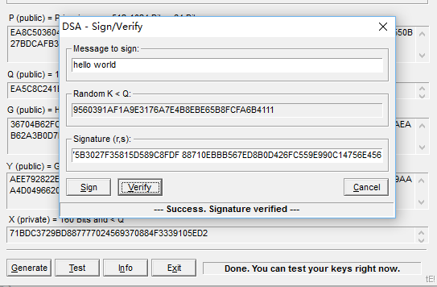

## DSA实验目的
数字签字目前采用较多的是非对称加密技术，其实现原理简单的说，就是由发送方利用杂凑函数对要传送的信息进行计算得到一个固定位数的消息摘要值，用发送者的私钥加密此消息的杂凑值所产生的密文即数字签字。然后将数字签字和消息一同发送给接收方。接收方收到消息和数字签字后，用同样的杂凑函数对消息进行计算得到新的杂凑值，然后用发送者的公开密钥对数字签字解密，将解密后的结果与自己计算得到的杂凑值相比较，如相等则说明消息确实来自发送方。 
    下面我们以DSA（Digital Signature Algorithm）为例，学习数字签字算法。
## DSA实验原理
### DSA算法描述
#### 变量描述
+ 全局变量的设置
    + 素数p， 
    + 素数q，是p的一个素因子， 
    +     其中h是整数，1<h<(p-1).
+ 私钥：
    + 私钥x是随机数或伪随机数，其中0<x<q.
+ 公钥：
    +      （p，q，g，y）为公钥。
+ 用户的随机数选择：
    + k为随机数或伪随机数，其中0<k<q。

#### 生成签名
基于以上选择的参数，DSA的签字过程如下： 
    
    
则 为对消息m的签字，显然，签字长度为320比特。其中，H是一个安全杂凑函数，在DSS标准中，采用SHA-1算法作为安全的杂凑函数。

#### 验证签名
+接收方接收到消息m的数字签字(r',s') 和消息m
+计算：     
  
  
  
+ 如果有:r'=v，则说明信息确实来自发送方。否则，签字是无效的。
## DSA 演示程序
### 参数选取-p,q,g,h,x,y

### 选择消息，参数k，和生成数字签名

 其中 r= D1F7EB2FB13AE04BC475B3027F35815D589C8FDF s=88710EBBB567ED8B0D426FC559E990C14756E456
### 验证结果，结果正确

