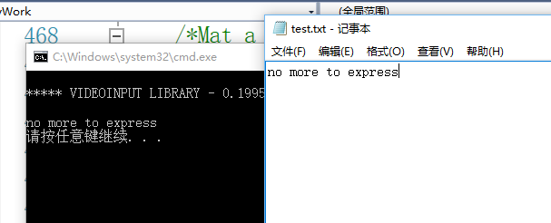
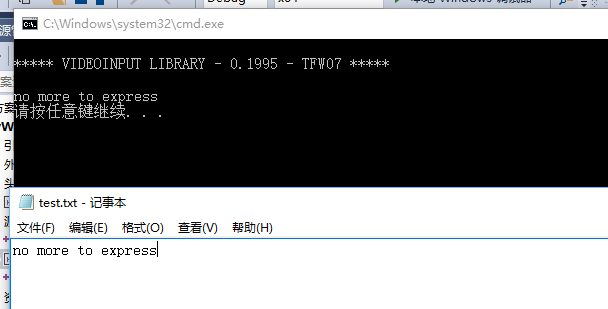

## Implemented the black/white rate-based label embedding for binary Images
### 实现
本次实现基于论文EMBEDDING ROBUST LABELS INTO IMAGES FOR COPYRIGHT PROTECTION的灰度和彩色图像的JPEG健壮性隐藏思路并且做了一定修改
#### 基本思想
+   基于JPEG模式的压缩技术在尽量不影响人类视觉感官的情况下在图片中嵌入信息。
+   JPEG图像存储技术(baseline操作模式)是将图像在空域分成一系列彼此独立的8*8的block，作为输入流，经过一系列压缩变换后得到对应的时域系数作为图像数据存储。显示数据时是将时域系数按一系列彼此独立8*8的block作为输入流，经过一系列对应的反变换得到空域采样点即原图像。
+   这一系列的变换是指归一化，离散余弦变化和量化，其中量化是指对每一个block的近似余弦系数分别除以它们对应位置的量化系数近似取整的操作，量化系数的选取将直接影响压缩度和图像恢复度。
+   本方法是在量化后的余弦系数上，修改特定的三个点之间的关系来存取一个信号位信息，三个点的选取来自于一个一维向量构成的位置集合，每个一维向量代表三个不同的点。

#### 隐藏的技术实现细节
+   小块的选取，要求信息在载体图像中随机分布，所以可以用秘钥作为随机发生器的种子，随机选取小块，用hashmap记录该小块是否已被选取，如果已被选取则随机产生下一小块，同样一个随机值来唯一确定位置集合的一个元素
+   小块的选取还依赖于允许修改的量化余弦值的最大距离MD和最小距离D假设选取的三个点的量化余弦值分别是a,b,c，不是一般性的如果满足 a<MD<c<MD<b 或者 a<MD<c<b（存取信号是1） 或者 a<c<MD<b (存取信号是0) 则修改 为三个点满足关系 a<MD<c<MD<b 并且标记该小块弃用。
+   小块的信息存储， 如果信号量为1，则修改 a>c+D b>c+D 否则则修改 a<c-D , a<c-D
#### 提取的技术实现细节
+   如果 a>c,b>c则恢复信息为1， 如果 a<c,b<c 则恢复信息为0
+   其他情况说明信息被破坏

#### 彩色图实现的技术细节
+   彩色图需要把RGB三层灰度图转换为YQI亮度和色度三层灰度图像，因为人眼对亮度相对敏感，所以我们从色度图层开始安装灰度图像的方法插入信息即可

#### 实现效果
原始灰度载体图像 
 
信息隐藏后的载体图像 
 
输入的秘密信息和提取得到的秘密信息 
 
原始彩色载体图像 
 
信息隐藏后的载体图像 
 
输入的秘密信息和提取得到的秘密信息 
 

#### 问题发现和改进方式
+   这种技术针对的应用图片当然是JPEG格式的图片，实验中发现每次压缩变换会有能量信息损失，但是对同一张图片多次压缩变换后能量损失会逐步减少趋于稳定，使用自带工具IMagePixelAnaysis::BasicIMagePixelAnaysis 生成日志发现，平均像素差异是0但是同一张图片不同压缩次数后对应像素不同数会依次降低，开始几乎是每个像素点都会复原后被修改，3次以后可以降低到1000以下，这说明多次DCT变换后高频能量损失殆尽图像趋于稳定，嵌入信息较不易被破坏。
+   图像的纠错，可以通过嵌入奇偶校验码或者其它校验的方式加以纠错，比如每个比特嵌入三次，根据频率判断0,1这样对高出错率的情况简单易行。
