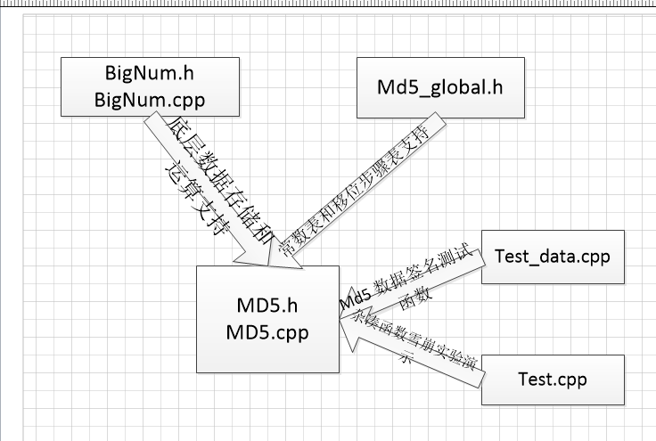
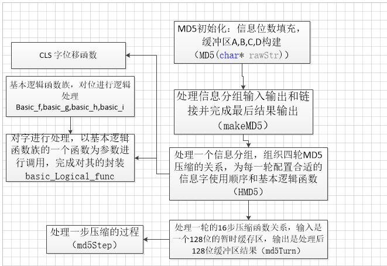
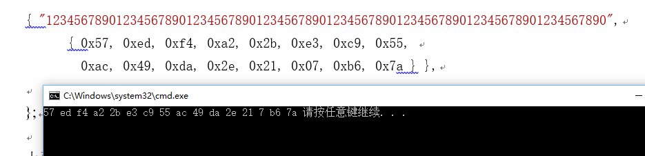
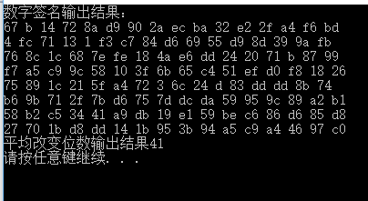

## MD5杂凑函数
### MD5程序文件调用关系图

#### MD5数字签名生成程序流程原理图

## 程序运行状况图
#### MD5函数运行样例图

>具体调用以及样例更改，请查看 test_data.cpp
#### MD5雪崩实验样例图

>具体调用请查看 test.cpp ，因为原文是“000000”，与其相对应的七组数据分别是"00000x",x取1到7，由于有些数和原文相比改变的二进制不止一位，最多可达3位，所以测试结果不准确，此处测量为41位，如果只改变一位或许测量值还会在增大