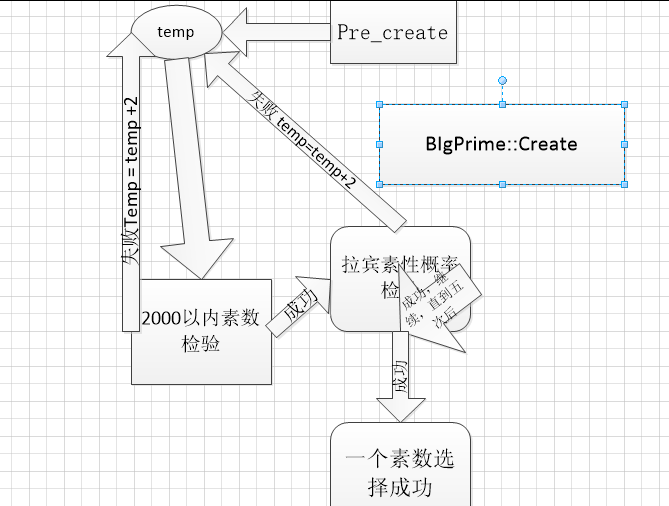
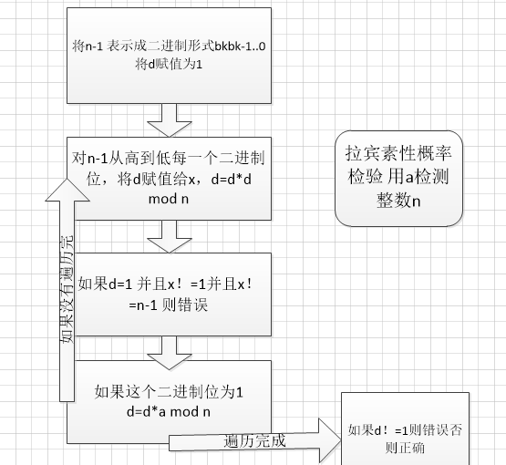
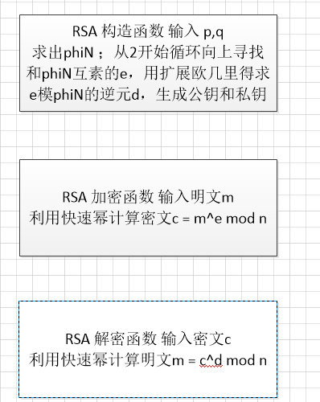

## RSA加密
### 生成素数原理图

#### 随机数生成原理图

#### 素性检验生成原理图

### RSA算法流程图

## 程序清单
- 大数类 BigNum.cpp BigNum.h 包含大数的加减乘除移位重载以及快速幂运算
- 大素数生成类 BigPrime.h BigPrime.cpp 包含2000以内素数生成，512位随机数预生成，2000内素数整除检验，拉宾素性检验
- RSA类 RSA.cpp RSA.h 包括RSA类生成，加解密运算，欧几里得求公约数算法，扩展欧几里得求逆元算法，这两个算法都是递归形式给出效率不高
- 每个类后cpp文件都有test测试数据
- 程序实现选择的数据结构不佳，导致基本运算十分耗时，大素数的生成尤其缓慢。文件附加了prime1.txt prime2.txt 是我租了4g4核 阿里云服务器两个小时四个线程跑出的结果，生成素数的概率还是比较低的，文件记录了整个素数得出的完整流程

## 致歉
报告说明文档给出的十分简陋，叙述内容多用流程图代替，实为整个编程内容在周末一天时间内编完十分疲惫，本学期任务太重又非如此不能跟上进度，希望老师谅解，作业纯个人完成，如假包换orz。