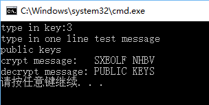

## 作业提交人 卫煜 信安 1410657
## 古典移位密码
### 算法流程图

### 运行结果

## 古典置换密码
### 算法流程图

### 运行结果

## 频率攻击
### 置换表结果

### 攻击步骤
- 统计密文字母频率分布表，对照已知大样本统计结果，可以确定前六个对应字母对应关系。（见上图）
- 统计密文单词频率分布表，对照已知大样本统计结果，可以确认上一步结果，并确定字母I对应关系 (下为部分统计结果图)

+ 从网上查找常用字母的数据集，和密文中单词进行匹配，缩小候选范围，下举一例
    * 确定密文文本 QCRRNEC  
    
    * 依据前两步结果 可翻译为 Q 'E' RR 'A' E 'E' (引号中为翻译后明文) 
    构造正则表达式 
    
    * 从网上获取七个字母的英文单词集合  
    
    * 程序匹配，输出可能结果 
    
    * 最后综合确定明文为 message ，即可得到几个字母新的对应结果
- 重复上步若干次，越来越容易得出结论

---
### 参考链接
[bestwordlist.com](https://www.bestwordlist.com/)
-题目 
