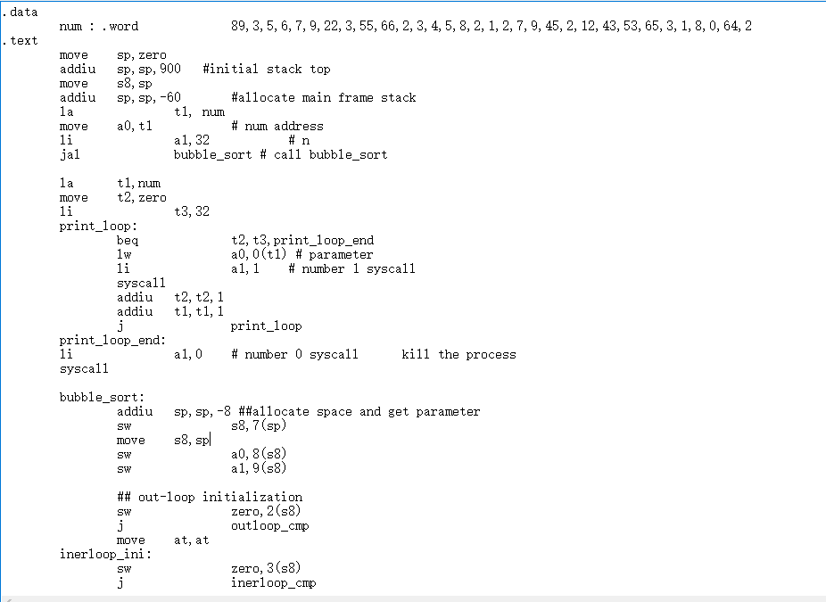
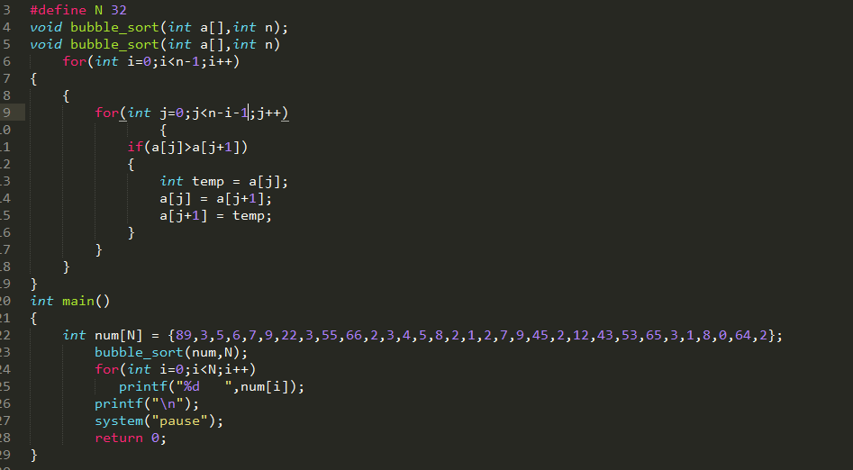
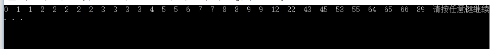

### 汇编语言的内容
&nbsp;&nbsp;&nbsp;&nbsp;&nbsp;&nbsp;&nbsp;&nbsp;
该汇编语言的设计目的是使cpu能够完成对一维**无符号型**数组的排序任务。汇编语言模范mips汇编语言编写，是mipsR3000语言功能的子集 
### 汇编语言指令集及每条指令的功能说明
| 指令 | 举例 | 含义 |
| ------| ------ | ------ |
| **arithmetic** |
| add unsigned | addu $1,$2,$3 | $1 = $2 + $3 |
| subtract unsigned | subu $1,$2,$3 | $1 = $2 - $3 |
| add immediate unsigned | addiu $1,$2,100 | $1 = $2 + 100 |
| set if less than  | slt $1, $2, $3  | if ($2 < $3), $1 = 1 else $1 = 0  |
| **transfer**  |
| move from one register to another  | move $1,$2  | $1 = $2  |
|  **shift** |   |   |
| shift left logical  | sll $1,$2,5  |  $1 = $2 << 5 (logical) |
| **memory**  |  
| load word  | lw $1, 1000($2)  | $1 = memory [$2+1000]  |
| store word  | sw $1, 1000($2)  | memory [$2+1000] = $1  |
| load immediate  | li v0, 128   | v0 = 128  |
| **branch**  |  
| branch if equal  | beq $1,$2,100  | if ($1 = $2), PC = PC + 100  |
| branch if not equal  | bne $1,$2,100  | if ($1 ≠ $2), PC = PC + 100 |
| **jump** |
| jump  | j 10000  | PC = 10000  |
| jump register  | jr $31  | PC = $31  |
| jump and link  | jal 10000 | $31 = PC + 1; PC = 10000  |

### 寄存器数目，寄存器比特长度和用途
+   Mips R3000 是32位的指令集体系结构，在这里定义NKU-CPU也是32位的处理器，所以寄存器都是32位的，为了适应c++模拟器编程，都是int类型变量。

| Register Number | Alternative Name | Description |
| ------| ------ | ------ |
| 0 | zero | the value 0 |
| 1 | $at | (assembler temporary) reserved by the assembler |
| 2-3  | $v0 - $v1  | (values) from expression evaluation and function results|
| 4-7  | $a0 - $a3  | (arguments) First four parameters for subroutine. Not preserved across procedure calls |
| 8-15  | $t0 - $t7  | (temporaries) Caller saved if needed. Subroutines can use w/out saving. Not preserved across procedure calls  |
| 16-23  | $s0 - $s7 | (saved values) - Callee saved. A subroutine using one of these must save original and restore it before exiting. Preserved across procedure calls  |
| 24-25  | $t8 - $t9  | (temporaries) Caller saved if needed. Subroutines can use w/out saving. These are in addition to $t0 - $t7 above.  Not preserved across procedure calls.  |
| 26-27  | $k0 - $k1  | reserved for use by the interrupt/trap handler |
| 28  | $gp  | global pointer. Points to the middle of the 64K block of memory in the static data segment. |
| 29  | $sp  | 栈首指针  |
| 30  | $s8/$fp   | 栈底指针  |
| 31  | $ra  | 用来保存过程返回后下一条指令的地址  |

### 数据类型
+   指令是string类型
+   数据是.word 类型，全部是4字节类型，在c++编程中定义为int类型变量

### 数据存储结构
+   指令在一个string数组中存储
+   静态数据和动态分配的数据都在模拟内存中存储，内存类型是int型数组
+   寄存器是32个int型数组
                  |

### 宏定义
#### 数据段
.data  
&nbsp;&nbsp;&nbsp;&nbsp;&nbsp;&nbsp;&nbsp;&nbsp;
a :  
&nbsp;&nbsp;&nbsp;&nbsp;&nbsp;&nbsp;&nbsp;&nbsp;
.word 25,26,27,28,29

+   根据.word后数据是单个还是多个，声明为四字节变量或者四字节变量数据
#### 代码段
.text 
&nbsp;&nbsp;&nbsp;&nbsp;&nbsp;&nbsp;&nbsp;&nbsp;
move at,at 

### NK-CPU 的汇编程序
+   汇编程序模拟cpu执行汇编语言（省略掉机器语言层次）的计算过程得到计算结果。
+   模拟汇编程序的逻辑分为三部分，初始化硬件，装载汇编程序，执行汇编程序。
+   汇编程序请参考附件 mipsAssemblyEmulation.cpp
+   直接运行请参考附件 mipsAssemblyEmulation.exe

#### 初始化硬件
+   完成寄存器汇编助记符和寄存器编号对应的初始化操作
+   完成操作码助记符和操作码编号对应的初始化操作
+   对应关系用STL容器map类型存储
+   初始化 program counter 指向指令内存的首地址行

#### 装载汇编程序
+   根据宏指令将静态数据和指令分别装载到数据内存和指令内存
+   完成静态数据助记符和静态数据在数据内存中首地址对应的操作
+   完成指令标记和其在指令内存中所指地址对应的操作
+   对应关系用STL容器map类型存储

#### 执行汇编程序
+   汇编程序执行分为装载指令，解析指令，执行指令三个步骤，在装载指令后，pc+1
+   解析指令通过解析操作码完成，在本模拟器中所有指令操作码均不同
+   执行指令分为解析操作数和执行动作两个部分完成
+   在该模拟器中自带system函数，当参数a1=0时，结束执行动作，当参数a1=1时输出数据地址为a0处的值。

### 对 20 个随机数的排序程序
+   汇编文件请参考     bubble_assemblycode.mipsasm
#### 汇编文件截图

#### 对应c++ 截图

#### 运行结果截图

   

